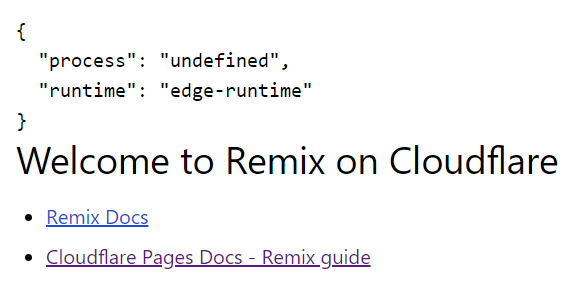

# remix-vite-edge

Sample of Remix running on Edge-runtime.

## vitePlugin/index.ts

```ts
import { once } from "node:events";
import { Readable } from "node:stream";
import path from "path";
import { AppLoadContext } from "@remix-run/cloudflare";
import { createReadableStreamFromReadable } from "@remix-run/node";
import { Connect, Plugin as VitePlugin } from "vite";
import { PlatformProxy } from "wrangler";
import type { ServerResponse } from "node:http";
import { EdgeRunner } from "./runner";

const exclude = [
  /.*\.css$/,
  /.*\.ts$/,
  /.*\.tsx$/,
  /^\/@.+$/,
  /\?t=\d+$/,
  /^\/favicon\.ico$/,
  /^\/static\/.+/,
  /^\/node_modules\/.*/,
];

type CfProperties = Record<string, unknown>;
type LoadContext<Env, Cf extends CfProperties> = {
  cloudflare: Omit<PlatformProxy<Env, Cf>, "dispose">;
};

type GetLoadContext<Env, Cf extends CfProperties> = (args: {
  request: Request;
  context: LoadContext<Env, Cf>;
}) => AppLoadContext | Promise<AppLoadContext>;

export function devServer<Env, Cf extends CfProperties>(opt?: {
  getLoadContext?: GetLoadContext<Env, Cf> | undefined;
}): VitePlugin {
  const { getLoadContext, ...options } = opt || {};
  const plugin: VitePlugin = {
    name: "edge-dev-server",
    configureServer: async (viteDevServer) => {
      const { getPlatformProxy } = await import("wrangler");
      const cloudflare = await getPlatformProxy<Env, Cf>(options);

      const context = { cloudflare };
      const runner = new EdgeRunner(viteDevServer);

      if (!viteDevServer.config.server.middlewareMode) {
        viteDevServer.middlewares.use(async (req, nodeRes, next) => {
          try {
            for (const pattern of exclude) {
              if (req.url) {
                if (pattern instanceof RegExp) {
                  if (pattern.test(req.url)) {
                    next();
                    return;
                  }
                }
              }
            }
            // eslint-disable-next-line @typescript-eslint/no-explicit-any
            const appModule: any = await runner.import(
              path.resolve(__dirname, "server.ts")
            );

            // eslint-disable-next-line @typescript-eslint/no-explicit-any
            const app: any = appModule["default"];
            const request = toRequest(req);

            const loadContext = getLoadContext
              ? await getLoadContext({ request: request.clone(), context })
              : context;

            const res: Response = await app(request, loadContext);
            if (res.status === 404) {
              next();
              return;
            }
            await toResponse(res, nodeRes);
          } catch (error) {
            next(error);
          }
        });
      }

      return () => {
        return null;
      };
    },

    config: () => {
      return {
        ssr: {
          resolve: {
            externalConditions: ["workerd", "worker"],
          },
        },
      };
    },
  };
  return plugin;
}

export function toRequest(nodeReq: Connect.IncomingMessage): Request {
  const origin =
    nodeReq.headers.origin && "null" !== nodeReq.headers.origin
      ? nodeReq.headers.origin
      : `http://${nodeReq.headers.host}`;
  const url = new URL(nodeReq.originalUrl!, origin);

  const headers = Object.entries(nodeReq.headers).reduce(
    (headers, [key, value]) => {
      if (Array.isArray(value)) {
        value.forEach((v) => headers.append(key, v));
      } else if (typeof value === "string") {
        headers.append(key, value);
      }
      return headers;
    },
    new Headers()
  );

  const init: RequestInit = {
    method: nodeReq.method,
    headers,
  };

  if (nodeReq.method !== "GET" && nodeReq.method !== "HEAD") {
    init.body = createReadableStreamFromReadable(nodeReq);
    (init as { duplex: "half" }).duplex = "half";
  }

  return new Request(url.href, init);
}

export async function toResponse(res: Response, nodeRes: ServerResponse) {
  nodeRes.statusCode = res.status;
  nodeRes.statusMessage = res.statusText;
  nodeRes.writeHead(res.status, Array.from(res.headers.entries()));
  if (res.body) {
    const readable = Readable.from(
      res.body as unknown as AsyncIterable<Uint8Array>
    );
    readable.pipe(nodeRes);
    await once(readable, "end");
  } else {
    nodeRes.end();
  }
}
```

## vitePlugin/server.ts

```ts
import { createRequestHandler } from "@remix-run/cloudflare";
import type { AppLoadContext } from "@remix-run/cloudflare";

const app = async (req: Request, context: AppLoadContext) => {
  // @ts-expect-error it's not typed
  // eslint-disable-next-line import/no-unresolved
  const build = await import("virtual:remix/server-build");
  const handler = createRequestHandler(build);
  return handler(req, context);
};

export default app;
```

## vite.config.ts

```ts
import {
  vitePlugin as remix,
  // cloudflareDevProxyVitePlugin as remixCloudflareDevProxy,
} from "@remix-run/dev";
import { defineConfig } from "vite";
import tsconfigPaths from "vite-tsconfig-paths";
import { devServer } from "./vitePlugin";

export default defineConfig({
  plugins: [
    // remixCloudflareDevProxy(),
    devServer(),
    remix({
      future: {
        v3_fetcherPersist: true,
        v3_relativeSplatPath: true,
        v3_throwAbortReason: true,
      },
    }),
    tsconfigPaths(),
  ],
});
```

## app/routes/\_index.tsx

```tsx
import type { MetaFunction } from "@remix-run/cloudflare";
import { useLoaderData } from "@remix-run/react";

export const meta: MetaFunction = () => {
  return [
    { title: "New Remix App" },
    {
      name: "description",
      content: "Welcome to Remix on Cloudflare!",
    },
  ];
};

export default function Index() {
  const value = useLoaderData<Record<string, unknown>>();
  return (
    <div className="font-sans p-4">
      <pre>{JSON.stringify(value, null, 2)}</pre>
      <h1 className="text-3xl">Welcome to Remix on Cloudflare</h1>
      <ul className="list-disc mt-4 pl-6 space-y-2">
        <li>
          <a
            className="text-blue-700 underline visited:text-purple-900"
            target="_blank"
            href="https://remix.run/docs"
            rel="noreferrer"
          >
            Remix Docs
          </a>
        </li>
        <li>
          <a
            className="text-blue-700 underline visited:text-purple-900"
            target="_blank"
            href="https://developers.cloudflare.com/pages/framework-guides/deploy-a-remix-site/"
            rel="noreferrer"
          >
            Cloudflare Pages Docs - Remix guide
          </a>
        </li>
      </ul>
    </div>
  );
}

export function loader() {
  return {
    process: typeof process,
    runtime: typeof EdgeRuntime === "undefined" ? "" : EdgeRuntime,
  };
}
```



## Reference link

https://github.com/yusukebe/vite-edge-dev-server
